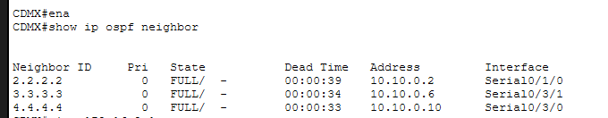
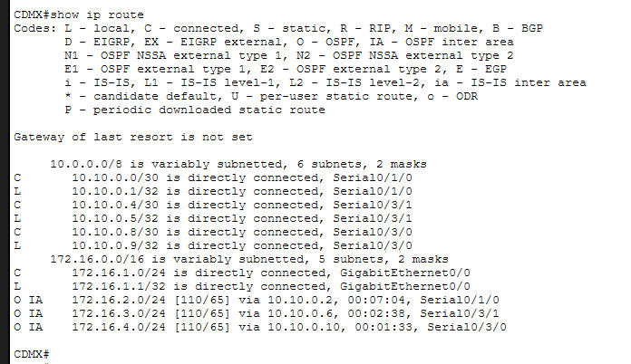
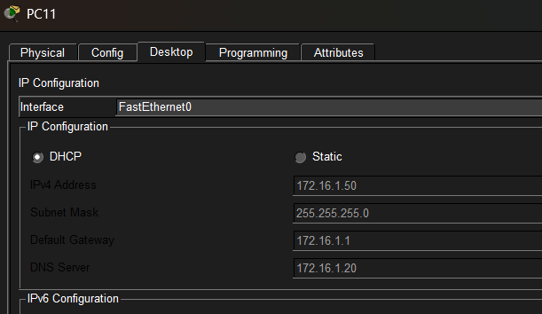
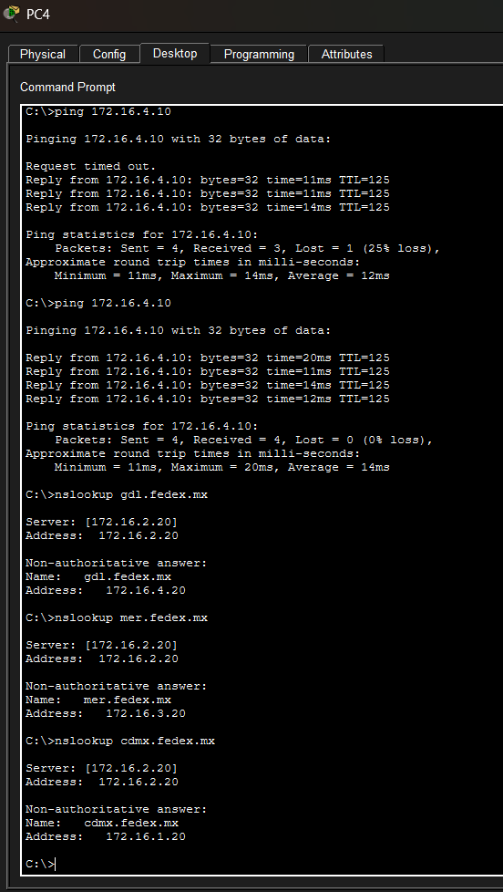

# 03 - OSPF Multiarea Lab

Simulación de red empresarial con OSPF multiarea, DHCP centralizado y DNS distribuido para FedEx México.
Implementada en Cisco Packet Tracer.

## Tecnologías implementadas
- OSPF Multiarea (Area 0, 1, 2, 3)
- DHCP centralizado con ip helper-address
- DNS distribuido por sucursal
- Enlaces WAN seriales /30
- Conectividad inter-area

## Topología

## Áreas OSPF
| Sucursal | Red LAN | Area OSPF | Router ID |
|---|---|---|---|
| CDMX | 172.16.1.0/24 | Area 0 (Backbone) | 1.1.1.1 |
| MTY | 172.16.2.0/24 | Area 1 | 2.2.2.2 |
| MER | 172.16.3.0/24 | Area 2 | 3.3.3.3 |
| GDL | 172.16.4.0/24 | Area 3 | 4.4.4.4 |

## Enlaces WAN
| Enlace | Red | IP CDMX | IP Vecino |
|---|---|---|---|
| CDMX ↔ MTY | 10.10.0.0/30 | 10.10.0.1 | 10.10.0.2 |
| CDMX ↔ MER | 10.10.0.4/30 | 10.10.0.5 | 10.10.0.6 |
| CDMX ↔ GDL | 10.10.0.8/30 | 10.10.0.9 | 10.10.0.10 |

## Evidencias

### Vecinos OSPF en estado FULL

### Rutas inter-area O IA

### DHCP funcionando

### DNS resolviendo nombres entre áreas y Ping entre sucursale

## Archivo Packet Tracer
[Descargar proyecto (.pkt)](fedex-network.pkt)
